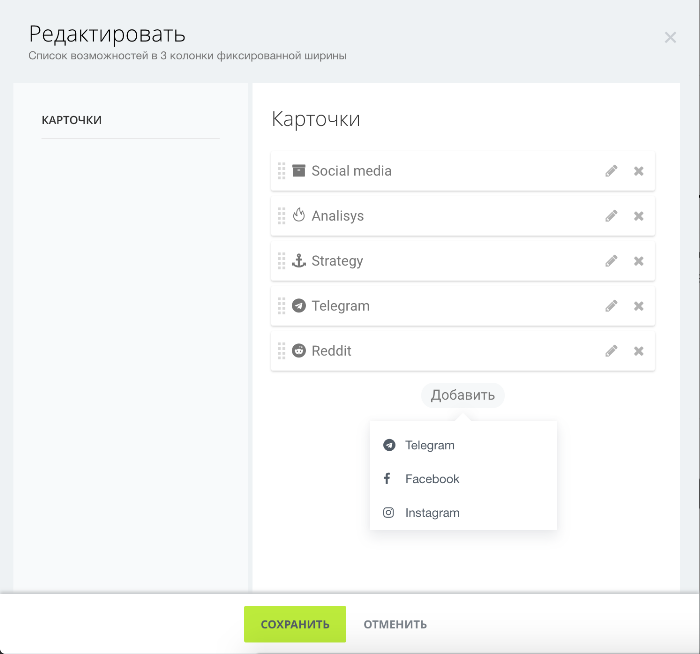

# Расширенное описание карточек



Тут может не хватать некоторых данных — дополним в ближайшее время







- нужны правки под стандарт написания





Для понимания принципов формирования и работы с карточками рекомендуется сначала ознакомиться с [манифестом](./manifest.md).

Расширенные карточки были призваны решать такие задачи:

- Разный набор контактов (e-mail и телефон, только телефон, телефон и соцсеть).
- Один и тот же набор полей, но разное графическое представление (социальные кнопки).
- И так далее.
Все карточки свернуты в компактные панели, с быстрым доступом к основным функциям: Сортировать, Редактировать, Удалить.



По клику на панель или на кнопку «Редактировать» - панель разворачивается в форму редактирования карточки.

Возможно добавление как пустой карточки, так и карточки из пресета.

Поддерживаются составные и динамические заголовок карточек. Название карточки формируется из тех данных что указал пользователь. Заголовок можно составлять из текста, изображений, иконок и ссылок. Заголовки будут динамически обновляться по мере редактирования значений карточки.

## Манифест расширенной карточки

```js
'cards' => [
    '.landing-block-card' => [
        'name' => Loc::getMessage('LANDING_BLOCK_4_FEATURES_3_COLS_...'),
        'label' => [
            '.landing-block-node-element-icon',
            '.landing-block-node-element-title'
        ],
        'presets' => [
            'telegram' => [...],
            'instagram' => [...],
            'reddit' => [...],
            'whatsapp' => [...],
            'skype' => [...]
        ]
    ]
]
```

**Ключ name**

Определяет заголовок группы карточек. По умолчанию используется для формирования заголовков карточек вида «Карточка 1», «Карточка 2»

**Ключ label**

Определяет правила формирования заголовка карточки. В качестве значения можно передавать селектор ноды, либо массив селекторов нод из которых необходимо брать значения для формирования заголовка.

**Ключ presets**

Определяет набор пресетов карточек текущего набора. Если значение свойства не пустое, то добавить новую карточку можно будет только из пресета. В качестве значения принимает массив пресетов, в качестве ключей массива необходимо указывать идентификаторы пресета.

## Пресет

```js
'telegram' => [
    'name' => ' Telegram',
    'html' => '<html-код-пресета>',
    'values' => [
        '.landing-block-node-element-title' => 'Telegram',
        '.landing-block-node-element-text' => 'Any text ...',
        '.landing-block-node-element-icon' => [
            'type' => 'icon',
            'classList' => [
                'landing-block-node-element-icon',
                'fa',
                'fa-telegram'
            ]
        ]
    ],
    'disallow' => [
        '.landing-block-node-element-icon'
    ]
]
```

**Ключ name**

Определяет заголовок пресета. Поддерживает html. Отображается в выпадающем списке пресетов.

**Ключ html**

Верстка карточки. Может может отличаться от верстки остальных карточек. При добавлении верстки в пресет, нужно учитывать, что редактироваться будут только те ноды, которые определены в nodes и не переопределены в disallow.

**Ключ values**

Определяет значения нод и полей карточки c которыми они будут инициализированы. Ключ - селектор ноды из nodes, значение - значение ноды в соответствии с типом ноды.

**Ключ disallow**

Определяет какие ноды пользователь не сможет редактировать. В значении ожидается массив селекторов.

## Верстка пресета

Верстка одного пресета это повторяемый блок кода.

Пример:

```html
<li class="landing-block-node-list-item col g-min-width-65 list-inline-item g-mr-0"
	data-card-preset="telegram">
	<a class="landing-block-node-list-item-link d-block g-py-15 g-px-30 g-bg-telegram--hover g-bg-telegram g-color-white text-center" href="#">
		<i class="landing-block-node-list-item-icon fa fa-telegram"></i>
	</a>
```

В идеологическом отличии от обычной карточки такие повторяемые контенты могут изменяться. Например, в одном `<li>` в примере выше может не быть ссылки, или вовсе, присутствовать изображение.



Обратите внимание, что содержимое карточек может отличаться, но внешний блок лучше оставлять одинаковым.
Также обратите внимание, что обязательно надо указывать data-card-preset="<код пресета>" как в пресете, так и в верстке (смотрите пример выше).


