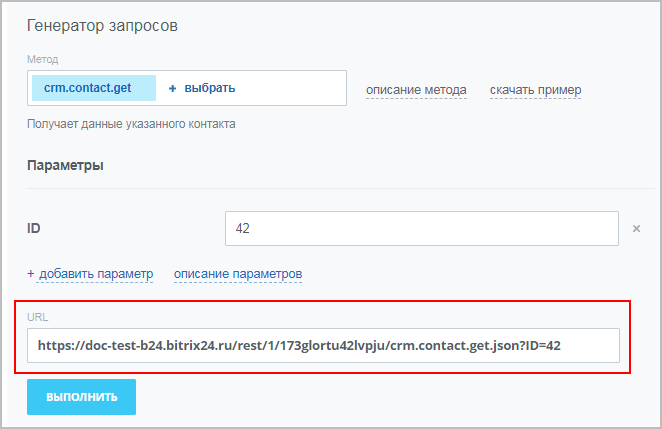
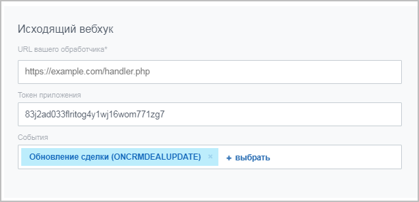

# Входящие и исходящие вебхуки



Тут может не хватать некоторых данных — дополним в ближайшее время







- дополнить "Частые кейсы и сценарии" про готовые сценарии на вебхуках





Локальный вебхук - это упрощенный способ обращения к методам и событиям REST API Битрикс24, специально предназначенный для использования в рамках одного конкретного портала.

Локальные вебхуки делятся на входящие и исходящие

## Входящий вебхук

Через пользовательский интерфейс раздела Разработчикам можно получить и зафиксировать ключ авторизации — входящий вебхук.

Этот ключ в дальнейшем можно использовать для вызова методов REST, и при этом данный ключ не ограничивается по сроку действия (в отличие от токенов авторизации протокола OAuth 2.0).

Это делает вебхуки исключительно простым и удобным механизмом для работы с REST, но при этом надо понимать, что эта простота имеет и свои недостатки:

- Для формирования вебхука требуется участие пользователя (вы не сможете генерировать вебхуки автоматически)
- Поскольку срока действия у вебхука нет, то любая "утечка" URL вебхука чревата получением доступа к вашему Битрикс24 в рамках прав конкретного вебхука. Именно поэтому данный механизм годится для "внутренних" интеграций, но не подходит для тиражных вариантов использования
- Ряд методов REST недоступен для работы через вебхуки, поскольку их логика требует "контекста" приложения, а никакого приложения в терминах Битрикс24 для вебхуков нет (в частности, методы встраивания приложений в интерфейс Битрикс24, события телефонии, часть событий чат-ботов и т.д.)

Но несмотря на эти ограничения, для подавляющего большинства задач интеграции в рамках конкретного проекта вебхуки представляются идеальным вариантом работы с REST API.



- [{#T}](../tutorials/crm/index.md)
- [{#T}](../tutorials/ai/add-joke-prompt.md)



Создать входящий вебхук можно из раздела **Разработчикам** (*Приложения > Разработчикам, вкладка «Готовые сценарии» > Другое > Входящий вебхук*).

В открывшейся форме:

- измените название вебхука
- в генераторе запросов выберите метод REST API (можно прочитать описание метода и скачать готовый пример кода с необходимыми параметрами для выполнения запросов)
- проверьте работу вебхука, нажав на кнопку **Выполнить**
- укажите права доступа, разрешив выполнять запросы только определенным инструментам Битрикс24

В генераторе запросов будет представлен образец URL, который нужно использовать при отправке данных из сторонней системы в Битрикс24



**URL состоит из:**

- **doc-test-b24.bitrix24.ru** — адрес вашего Битрикс24
- **/rest** — указание на то, что работа ведётся через rest с вебхуками
- **/1** — идентификатор пользователя, создавшего вебхук
- **/173glortu42lvpju** — секретный код

> **Внимание!** Данный код является конфиденциальной информацией. Его необходимо держать в секрете

- **/crm.contact.get** — вызываемый метод REST API. В данном случае — метод, возвращающий контакт по идентификатору
- **.json** — необязательный параметр («транспорт»). При создании новых вебхуков можно не указывать (по умолчанию будет использоваться `.json`). В конструкторе готовых решений `.json` подставляется явно
- **?ID=42** — параметры, необходимые для конкретного метода. В данном случае — идентификатор. Параметры указываются после вопросительного знака и разделяются символом `&`

## Исходящий вебхук

Для некоторых сценариев было бы удобно, чтобы наша автоматизация срабатывала сама, если пользователь изменяет какие-то данные в Битрикс24. Для этого в локальных интеграциях есть инструмент, который называется «Исходящий вебхук».



- [{#T}](../tutorials/crm/index.md)
- [{#T}](../tutorials/ai/add-joke-prompt.md)



> **Внимание!** Для работы исходящего вебхука в коробочной версии Битрикс24 обязательна активная лицензия, на демо-порталах исходящий вебхук работать не будет

Создать исходящий вебхук можно из раздела **Разработчикам** (*Приложения > Разработчикам, вкладка Готовые сценарии > Другое > Исходящий вебхук*).

В открывшейся форме:

1. Измените название вебхука
2. Укажите **URL вашего обработчика** — страницу на стороннем ресурсе, куда будет обращаться вебхук
3. Выберите событие, на которое будет инициализироваться вебхук

    При создании исходящего вебхука будет выведен токен в виде строки из случайных знаков. Этот код позволит внутри обработчика проверить, действительно ли обработчик вызван вашим Битрикс24.

    

4. На странице обработчика разместите код:

    Пример кода обработчика для события [ONCRMDEALUPDATE](../api-reference/crm/deals/events/on-crm-deal-update.md)

    ```php
    <?
    print_r($_REQUEST);
    writeToLog($_REQUEST, 'incoming');
    /**
    * Write data to log file.
    *
    * @param mixed $data
    * @param string $title
    *
    * @return bool
    */
    function writeToLog($data, $title = '') {
        $log = "\n------------------------\n";
        $log .= date("Y.m.d G:i:s") . "\n";
        $log .= (strlen($title) > 0 ? $title : 'DEBUG') . "\n";
        $log .= print_r($data, 1);
        $log .= "\n------------------------\n";
        file_put_contents(getcwd() . '/hook.log', $log, FILE_APPEND);
        return true;
    }
    ```

    Для проверки откройте любую сделку на редактирование и сохраните изменения, в логе отобразится примерно такая история: 

    ```plaintext
    2017.01.17 12:58:29
    incoming
    Array
    (
        [event] => ONCRMDEALUPDATE
        [data] => Array
            (
                [FIELDS] => Array
                    (
                        [ID] => 662
                    )

            )

        [ts] => ххх
        [auth] => Array
            (
                [domain] => ххх.bitrix24.ru
                [client_endpoint] => https://ххх.bitrix24.ru/rest/
                [server_endpoint] => https://oauth.bitrix.info/rest/
                [member_id] => ххх
                [application_token] => ххх
            )

    )
    ```

## Продолжите изучение

- [{#T}](local-apps.md)