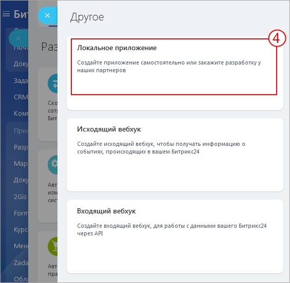
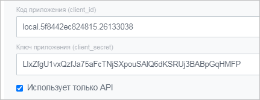

# Серверное локальное приложение без пользовательского интерфейса

## Установка

Пример состоит из [SDK CRest](https://github.com/bitrix-tools/crest/) и PHP-файла с примером, которые вы должны разместить на своем веб-сервере до добавления приложения в свой Битрикс24. Приложение умеет получать авторизацию пользователя Битрикс24 и используя ее, находясь при этом вне Битрикс24, обращаться к REST API, получая ФИО пользователя, установившего его.

> **Внимание!** Данный пример работает на основе *SDK CRest*. Перед использованием примера необходимо открыть через браузер файл **checkserver.php** и проверить корректность настроек вашего сервера. [Подробнее](../how-to-use-examples.md).

[Скачать архив](https://dev.1c-bitrix.ru/docs/marketplace-and-apps24/server-no-ui-crest.zip)

Установить локальное приложение можно либо из раздела **Разработчикам** (*Приложения > Разработчикам, вкладка «Готовые сценарии» > Другое > Локальное приложение*), либо перейдя по цепочке: Приложения (1) — Разработчикам (2) — Другое (3) — Локальное приложение (4):

В открывшейся форме заполните базовые поля и укажите необходимые для приложения права (для нашего примера нужны права на управление пользователями), указав **Путь вашего обработчика** (это означает, что ваше приложение уже должно быть физически доступно по URL по протоколу HTTPS до того, как вы станете добавлять его в ваш Битрикс24).

Необходимо включить опцию **Приложение использует только API** — именно она указывает Битрикс24, что ваше приложение не будет показывать пользовательский интерфейс внутри Битрикс24. В этом случае, как вы увидите, в форме будут скрыты поля, в которых обычно указывается название пункта меню для вызова приложения из Битрикс24. Приложения, у которых включена опция «Приложение использует только API», либо предоставляют пользовательский интерфейс по какому-то своему URL, либо вообще не предоставляют пользовательский интерфейс.

Обратите также внимание на то, что мы заполнили поле **Путь для первоначальной установки**, указав **install.php** из архива с примером. Этот URL вызывается только один раз при сохранении формы локального приложения. Именно этот URL служит обработчиком события [`ONAPPINSTALL`](../api-reference/common/events/on-app-install.md), в котором мы и сохраняем токены пользователя, установившего приложение.

После сохранения вы останетесь в форме добавления, но Битрикс24 вам сразу покажет ключи авторизации для протокола OAuth 2.0, которые вам потребуются внутри кода приложения:

Поскольку приложение без интерфейса работает вне Битрикс24, то оно должно реализовывать полный протокол авторизации OAuth 2.0. Откройте из примера файл **settings.php** и заполните константы с кодом приложения `C_REST_CLIENT_ID` и секретным ключом `C_REST_CLIENT_SECRET`, полученными при сохранении формы.

Загрузите измененный пример на свой сервер.

В Битрикс24 можно перейти в список **Интеграции** (*Приложения > Разработчикам > Интеграции*) и убедиться в появлении нового приложения в списке локальных приложений в вашем Битрикс24:

## Использование

> **Внимание!** Данный пример работает на основе *SDK CRest*. Перед использованием примера необходимо открыть через браузер файл **checkserver.php** и проверить корректность настроек вашего сервера. [Подробнее](../how-to-use-examples.md).

Откройте файл **index.php** из примера в браузере по вашему URL.

Запущенное приложение выведет ФИО установившего приложение пользователя, получая его по REST API с использованием авторизационных данных, сохраненных при создании приложения, а также автоматически продлевая токены (если при запросе окажется, что они недействительны).

## Продолжите изучение

- [{#T}](static-local-app.md)
- [{#T}](serverside-local-app-with-ui.md)
